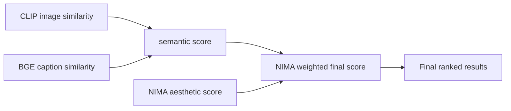

# Photo Search BGE Rerank Service

> A compact open-source photo search engine built with FastAPI, Chinese-CLIP, PostgreSQL pgvector, and BGE-M3 caption reranking.  
> 中文說明在前，English documentation follows.

## 專案結構

```text
photo_search_bge_service/
├── api/                  # FastAPI 伺服器程式碼：HTTP request/response、caption service client
│   ├── main.py           # API endpoints
│   ├── config.py         # .env 設定
│   ├── db.py             # PostgreSQL / pgvector connection helper
│   ├── caption_client.py # 外部 Qwen2-VL / caption service client
│   └── image_io.py       # 圖片讀取、縮圖、儲存
├── worker/               # AI 處理邏輯
│   ├── models/           # Chinese-CLIP 與 BGE-M3 的載入與推論
│   │   └── encoders.py
│   ├── pipeline.py       # 寫入、caption embedding、兩階段搜尋與 rerank 核心邏輯
│   └── scripts/          # backfill / benchmark / init_db scripts
├── db/                   # pgvector 初始化與 migration SQL
│   ├── schema.sql
│   └── 04_caption_bge_embeddings.sql
├── client_examples/      # 給客戶端看的範例
│   └── ios_swift/
│       └── PhotoSearchClient.swift
├── docker-compose.yml    # PostgreSQL + pgvector 一鍵部署
├── requirements.txt
├── .env.example
└── README.md
```

## 這個服務做什麼

這是一個最小可部署的智慧相簿搜尋服務。它不包含完整相簿 App，也不包含品質篩選、GPS、RAG 等其他研究模組；它只專注在一條核心鏈路：

```text
照片進來
  -> Chinese-CLIP 產生 image embedding
  -> 存進 PostgreSQL pgvector
  -> 產生/寫入 caption
  -> BGE-M3 預先產生 caption embedding
  -> 搜尋時先做 CLIP top-K
  -> 再用 BGE caption embedding rerank
```

## 架構圖：兩階段檢索 + Caption Rerank

```mermaid
flowchart TD
    A[Client / iOS App] -->|POST /api/photos/upload| B[FastAPI API Layer]
    B --> C[worker.pipeline upload_photo_record]
    C --> D[Chinese-CLIP Image Encoder
512-d image vector]
    D --> E[(PostgreSQL pgvector
photos.image_embedding)]

    A -->|caption_a / caption_b| F[POST /api/photos/{id}/captions]
    F --> G[BGE-M3 Text Encoder
1024-d caption vector]
    G --> H[(caption_a_embedding
caption_b_embedding)]

    A -->|POST /api/photos/search| I[Query]
    I --> J[Chinese-CLIP Text Encoder]
    J --> K[Stage 1: pgvector top-K image retrieval]
    K --> L[Stage 2: BGE-M3 query-caption rerank]
    H --> L
    L --> M[final_score = 0.7 * clip_sim + 0.3 * caption_sim]
    M --> A
```

## NIMA 加權放在哪裡

目前這個開源骨架沒有放 NIMA 模型，因為這版只打包搜尋與 BGE caption rerank。不過如果你要把 NIMA 美學分數加回來，推薦放在 final ranking 的最後一層，而不是取代語意分數：

```text
semantic_score = 0.7 * clip_sim + 0.3 * caption_sim
final_score    = 0.9 * semantic_score + 0.1 * normalized_nima_score
```

架構上會是：



建議 NIMA 只做小權重，例如 `0.05-0.15`，避免「漂亮但不相關」的照片壓過真正符合 query 的照片。

## 模型與向量欄位

| DB 欄位 | 模型 | 維度 | 用途 |
|---|---|---:|---|
| `image_embedding` | `OFA-Sys/chinese-clip-vit-base-patch16` | 512 | 第一階段圖文召回 |
| `caption_a_embedding` | `BAAI/bge-m3` | 1024 | Caption A text rerank |
| `caption_b_embedding` | `BAAI/bge-m3` | 1024 | Caption B text rerank |

注意：Chinese-CLIP image vector 和 BGE-M3 caption vector 是不同模型、不同維度、不同語意空間，不能混在同一個欄位。

## 安裝

建議 Python 3.10-3.11。

```bash
cd photo_search_bge_service
python3.11 -m venv venv
source venv/bin/activate
pip install -r requirements.txt
cp .env.example .env
```

啟動 PostgreSQL + pgvector：

```bash
docker compose up -d
```

初始化 DB：

```bash
python worker/scripts/init_db.py
```

啟動 API：

```bash
uvicorn api.main:app --host 0.0.0.0 --port 8000
```

健康檢查：

```bash
curl http://localhost:8000/health
```

## API 使用

### 1. 上傳照片

```bash
curl -X POST http://localhost:8000/api/photos/upload   -F "file=@/path/to/photo.jpg"   -F "user_id=1"   -F "local_id=ios-local-id-001"
```

### 2. 寫入 caption 並預先計算 BGE embedding

```bash
curl -X POST http://localhost:8000/api/photos/1/captions   -F "caption_a=海邊夕陽下的幾位朋友正在散步，天空呈現溫暖橘色。"   -F "caption_b=照片中有一群朋友在海邊散步，夕陽光線映在海面上，整體氛圍溫暖且放鬆。"
```

### 3. 搜尋

```bash
curl -X POST http://localhost:8000/api/photos/search   -F "query=海邊夕陽"   -F "user_id=1"   -F "limit=10"   -F "rerank=true"   -F "rerank_k=50"   -F "alpha=0.7"   -F "caption_style=A"
```

## 外部 Caption Service

如果你有 Qwen2-VL 或其他 image caption service，可以在 `.env` 設定：

```text
CAPTION_SERVICE_URL=https://your-caption-service.example.com
CAPTION_SERVICE_TOKEN=optional-token
```

服務需支援：

```text
POST /caption/all
multipart file: photo.jpg
```

可接受回傳：

```json
{
  "A": {"caption": "short caption"},
  "B": {"caption": "detailed caption"}
}
```

或：

```json
{
  "A": "short caption",
  "B": "detailed caption"
}
```

## 效能提升

在 Mac mini M4 24GB、BGE-M3 CPU 測試 top-50 caption rerank：

| 方法 | Median latency |
|---|---:|
| 每次搜尋即時計算 50 條 caption embedding | 5527.8 ms |
| 預先計算 caption embedding，搜尋時只 encode query | 59.5 ms |

提升：

```text
約 93x faster
```

這就是為什麼本專案把 `caption_a_embedding` / `caption_b_embedding` 預先寫入 DB。

## iOS Swift 範例

範例在：

```text
client_examples/ios_swift/PhotoSearchClient.swift
```

它示範了：

```text
uploadPhoto(jpegData:userId:localId:)
attachCaptions(cloudId:captionA:captionB:)
search(query:userId:limit:)
```

## 回填既有 caption embedding

如果 DB 已經有 caption，但還沒有 BGE embedding：

```bash
python worker/scripts/backfill_caption_embeddings.py --style all
```

## English Documentation

## What This Service Does

This is a minimal deployable semantic photo search service. It focuses only on:

```text
photo upload
  -> Chinese-CLIP image embedding
  -> PostgreSQL pgvector storage
  -> caption attach/generate
  -> BGE-M3 caption embedding precompute
  -> CLIP top-K retrieval
  -> BGE caption rerank
```

It does not include the full album app, GPS metadata filtering, quality filtering, or RAG generation modules.

## Architecture

```text
Stage 1: Chinese-CLIP text-to-image retrieval
Stage 2: BGE-M3 query-to-caption reranking

final_score = 0.7 * clip_sim + 0.3 * caption_sim
```

Chinese-CLIP and BGE-M3 vectors are different:

| Column | Model | Dimension | Purpose |
|---|---|---:|---|
| `image_embedding` | `OFA-Sys/chinese-clip-vit-base-patch16` | 512 | image retrieval |
| `caption_a_embedding` | `BAAI/bge-m3` | 1024 | caption A rerank |
| `caption_b_embedding` | `BAAI/bge-m3` | 1024 | caption B rerank |

## Optional NIMA Weighting

NIMA is not included in this minimal package, but it can be added as a final quality-aware score:

```text
semantic_score = 0.7 * clip_sim + 0.3 * caption_sim
final_score    = 0.9 * semantic_score + 0.1 * normalized_nima_score
```

Keep the NIMA weight small so visual quality does not override semantic relevance.

## Install

```bash
cd photo_search_bge_service
python3.11 -m venv venv
source venv/bin/activate
pip install -r requirements.txt
cp .env.example .env
docker compose up -d
python worker/scripts/init_db.py
uvicorn api.main:app --host 0.0.0.0 --port 8000
```

## APIs

Upload:

```bash
curl -X POST http://localhost:8000/api/photos/upload   -F "file=@/path/to/photo.jpg"   -F "user_id=1"   -F "local_id=ios-local-id-001"
```

Attach captions:

```bash
curl -X POST http://localhost:8000/api/photos/1/captions   -F "caption_a=A sunset beach photo."   -F "caption_b=A group of friends walking on the beach at sunset."
```

Search:

```bash
curl -X POST http://localhost:8000/api/photos/search   -F "query=sunset beach"   -F "user_id=1"   -F "limit=10"   -F "rerank=true"   -F "rerank_k=50"   -F "alpha=0.7"   -F "caption_style=A"
```

## Performance

Measured top-50 BGE-M3 caption rerank latency on Mac mini M4 24GB:

| Method | Median latency |
|---|---:|
| Encode 50 captions on every search | 5527.8 ms |
| Precompute caption embeddings, encode query only | 59.5 ms |

Median speedup:

```text
about 93x faster
```


## 授權 / License

本專案以 MIT License 開源。你可以自由使用、修改、散布與商業使用，但需保留授權聲明。

This project is released under the MIT License. You may use, modify, distribute, and use it commercially as long as the license notice is preserved.
